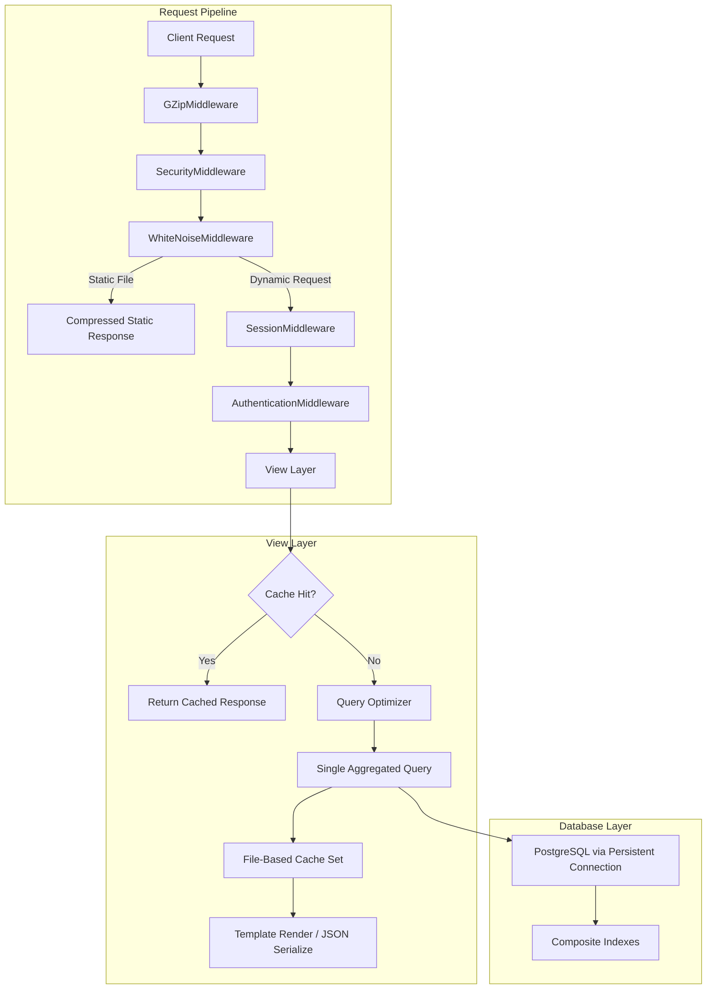

# Design Document: Performance Optimization

## Overview

This design addresses server-side performance optimization for the CSG Task Management System — a Django 4.2 application running on Neon PostgreSQL (free tier), deployed on Render with WhiteNoise serving static files and file-based Django cache for application caching.

The optimization targets ten key areas: database query consolidation, indexing strategy, caching architecture, static file delivery, API response efficiency, middleware ordering, template rendering, connection persistence, permission check optimization, and export batching. All changes operate within existing free-tier infrastructure constraints (no Redis, no Celery, no additional workers).

### Design Rationale

The current codebase already uses some optimization patterns (conditional aggregation on dashboard, select_related in list views, cached notification counts). However, several views still issue redundant queries (Kanban board fires per-column queries, reports view counts separately, DashboardCharts API loops per-month), and the static pipeline lacks compression. This design standardizes and extends existing patterns across all views and API endpoints.

## Architecture



### Middleware Stack Order (Final)

```python
MIDDLEWARE = [
    'django.middleware.security.SecurityMiddleware',
    'django.middleware.gzip.GZipMiddleware',
    'whitenoise.middleware.WhiteNoiseMiddleware',
    'django.contrib.sessions.middleware.SessionMiddleware',
    'django.middleware.common.CommonMiddleware',
    'django.middleware.csrf.CsrfViewMiddleware',
    'django.contrib.auth.middleware.AuthenticationMiddleware',
    'django.contrib.messages.middleware.MessageMiddleware',
    'django.middleware.clickjacking.XFrameOptionsMiddleware',
]
```

**Rationale**: SecurityMiddleware sets HSTS/security headers on all responses. GZipMiddleware compresses dynamic HTML/JSON responses. WhiteNoise intercepts `/static/` requests and short-circuits the rest of the middleware stack for those, serving pre-compressed files with immutable caching headers.

## Components and Interfaces

### 1. Query Optimizer Patterns

#### Conditional Aggregation (Dashboard, Stats API, Reports)

Replace multiple `count()` calls with a single `aggregate()` using conditional `Count`:

```python
from django.db.models import Count, Q

counts = base_qs.aggregate(
    active=Count('id', filter=Q(status__in=active_statuses)),
    completed=Count('id', filter=Q(status='completed')),
    overdue=Count('id', filter=Q(due_date__lt=today, status__in=active_statuses)),
    upcoming=Count('id', filter=Q(
        due_date__gte=today,
        due_date__lte=today + timedelta(days=7),
        status__in=active_statuses
    )),
)
```

This pattern applies to: `DashboardView`, `DashboardStatsAPIView`, `DashboardChartsAPIView` (status/priority distributions), and `ReportsDashboardView`.

#### TruncMonth Aggregation (Charts API)

Replace per-month loop queries with a single `TruncMonth` annotation:

```python
from django.db.models.functions import TruncMonth

monthly = (
    base_qs
    .filter(status='completed')
    .annotate(month=TruncMonth('completion_date'))
    .values('month')
    .annotate(count=Count('id'))
    .order_by('month')
)
```

#### Kanban Board Single-Fetch Partitioning

Fetch all tasks in one queryset, then partition in Python:

```python
all_tasks = list(
    base_qs
    .exclude(status='completed')
    .select_related('created_by', 'organization')
    .prefetch_related(
        'assigned_officers',
        'assigned_officers__officer_profile',
        'assigned_officers__officer_profile__position'
    )
    .order_by('-created_at')
)

columns = []
for status_code, status_label in Task.STATUS_CHOICES:
    if status_code in ['overdue', 'completed']:
        continue
    group = [t for t in all_tasks if t.status == status_code]
    columns.append({
        'code': status_code,
        'label': status_label,
        'tasks': group[:50],
        'count': len(group),
    })
```

#### Select/Prefetch Chains

Standard chain for task-related querysets:

```python
qs.select_related('created_by', 'organization').prefetch_related(
    'assigned_officers',
    'assigned_officers__officer_profile',
    'assigned_officers__officer_profile__position'
)
```

### 2. Database Index Strategy

All indexes defined in model `Meta.indexes` and deployed via Django migrations:

| Model | Fields | Purpose |
|-------|--------|---------|
| Task | (organization, is_archived, status) | Task list/board filtering |
| Task | (organization, due_date) | Due date range queries |
| Task | (status, due_date) | Overdue/upcoming queries |
| Task | (-created_at) | Default ordering |
| TaskAssignment | (officer, task) | Officer assignment lookups |
| TaskAssignment | (task) | Task-based assignment queries |
| Notification | (recipient, is_read, -created_at) | Unread notification queries |
| Notification | (recipient, -created_at) | Notification listing |
| User | (organization, is_active, role) | Officer list by org and role |

The Task and TaskAssignment indexes already exist. The User index is new and requires a migration.

### 3. Caching Architecture

#### Cache Backend

File-based cache (`django.core.cache.backends.filebased.FileBasedCache`) — no infrastructure changes needed.

#### Cache Key Registry

| Key Pattern | TTL | Content | Invalidated By |
|-------------|-----|---------|----------------|
| `org_{org_id}_officers` | 60s | Officer queryset for filter dropdowns | Officer add/remove, role change |
| `notif_unread_{user_id}` | 30s | Integer count of unread notifications | Notification create, mark read |
| `approved_orgs_list` | 60s | List of approved Organization objects | Org status change |
| `dashboard_charts_{user_id}_{org_id}_{scope}` | 30s | Full chart response dict | Task create/update/delete |
| `reports_officers_{org_id}` | 300s | Officer list for reports filter | Officer add/remove |

#### Invalidation Strategy

```python
# In task save/delete signals or service layer:
from django.core.cache import cache

def invalidate_task_caches(task):
    """Invalidate caches affected by a task mutation."""
    org_id = task.organization_id
    if org_id:
        cache.delete(f'org_{org_id}_officers')
    # Invalidate notification caches for assigned officers
    for user_id in task.assigned_officers.values_list('id', flat=True):
        cache.delete(f'notif_unread_{user_id}')
    # Invalidate dashboard chart caches (pattern-based deletion)
    # File-based cache doesn't support pattern delete, so use versioning or explicit keys
    cache.delete(f'dashboard_charts_{task.created_by_id}_{org_id}_all')
    cache.delete(f'dashboard_charts_{task.created_by_id}_{org_id}_my_tasks')
```

#### Cache Miss Handling

All cache reads follow this pattern:

```python
value = cache.get(cache_key)
if value is None:
    value = expensive_query()
    cache.set(cache_key, value, ttl)
return value
```

No exceptions are raised on cache miss — the system always falls back to a fresh query.

### 4. Static File Pipeline

#### Configuration

```python
# settings.py (production)
STORAGES = {
    "default": {"BACKEND": "core.storage.SmartMediaCloudinaryStorage"},
    "staticfiles": {"BACKEND": "whitenoise.storage.CompressedManifestStaticFilesStorage"},
}

WHITENOISE_MAX_AGE = 31536000  # 1 year for hashed files
```

#### Requirements Addition

Add `Brotli` to `requirements.txt` to enable Brotli pre-compression during `collectstatic`:

```
Brotli==1.1.0
```

WhiteNoise automatically detects the Brotli library and generates `.br` files alongside `.gz` files during `collectstatic`. At request time, it serves the best available encoding based on `Accept-Encoding`.

#### Font CORS

WhiteNoise's `CompressedManifestStaticFilesStorage` handles CORS headers for font files automatically when `WHITENOISE_ALLOW_ALL_ORIGINS = True` (default behavior for font extensions).

### 5. API Response Optimization

#### Field Limiting

```python
class TaskListAPIView(APIView):
    def get(self, request):
        # ... queryset building ...
        data = list(tasks.values(
            'id', 'task_number', 'title', 'status',
            'priority', 'progress', 'due_date'
        )[:50])
        response = Response(data)
        response['Cache-Control'] = 'private, max-age=0'
        return response
```

#### Cache-Control Headers

| Endpoint Type | Header Value |
|--------------|-------------|
| User-specific (TaskList, Notifications) | `private, max-age=0` |
| Aggregated (DashboardStats, DashboardCharts) | `private, max-age=30` |

### 6. Connection Persistence

```python
# Already configured via dj_database_url.parse():
DATABASES = {
    'default': dj_database_url.parse(
        NEON_DB_URL,
        conn_max_age=600,
        conn_health_checks=True
    )
}
```

The current settings already configure `conn_max_age=600` and `conn_health_checks=True`. No changes needed — this design documents the existing correct configuration and ensures it is not accidentally removed.

With Render free tier running 1 gunicorn worker (or 2 max), total connections = workers × 1 = 1-2, well within Neon's free-tier limit.

### 7. Template Rendering Patterns

#### Pre-computed Context

Views compute all data before passing to templates. Templates never call methods that trigger queries:

```python
# GOOD - in view
ctx['can_edit'] = request.user.can_edit_task(task)  # uses prefetch cache
ctx['officer_count'] = task.assigned_officers_count  # uses prefetch cache

# BAD - in template
# {{ task.assigned_officers.filter(role='executive').count }}
```

#### Zero-Query Template Rendering

The task list already uses `select_related` and `prefetch_related`. The design ensures all new views follow this pattern — particularly the Kanban board (which currently issues per-column queries) and the calendar events view.

### 8. Permission Check Optimization

#### Prefetch-Aware Membership Check

```python
def can_edit_task(self, task):
    if self.has_task_override:
        return True
    if task.created_by_id == self.id:
        return True
    # Use prefetch cache if available (all() hits cache, not DB)
    if hasattr(task, '_prefetched_objects_cache') and 'assigned_officers' in task._prefetched_objects_cache:
        return any(u.id == self.id for u in task.assigned_officers.all())
    # Fallback to efficient exists() query
    return task.assigned_officers.filter(id=self.id).exists()
```

#### Request-Level Organization Caching

The `get_organization` method already caches on `request._cached_org`. This design ensures all permission checks that need the organization use this cached value rather than traversing the FK again.

### 9. Export Batching

For exports exceeding 500 tasks:

```python
def export_large_queryset(qs):
    """Process large querysets in chunks to limit memory."""
    if qs.count() > 500:
        for task in qs.iterator(chunk_size=200):
            yield task
    else:
        yield from qs
```

The PDF and Excel export views will use `iterator(chunk_size=200)` for large exports, building the output incrementally rather than loading all task objects into memory at once.

### 10. GZip Response Compression

Django's `GZipMiddleware` compresses HTML and JSON responses exceeding 200 bytes when the client sends `Accept-Encoding: gzip`. It does not compress:
- Streaming responses
- File downloads (PDF, Excel)
- Responses smaller than 200 bytes

Positioned after SecurityMiddleware (to ensure security headers are set) and before WhiteNoiseMiddleware (which handles its own compression for static files).

## Data Models

No new models are introduced. Changes are limited to:

1. **New index on User model**: `(organization, is_active, role)` via `Meta.indexes` addition
2. **Migration**: One new migration in the `accounts` app for the User index

```python
# accounts/models.py - Meta addition
class User(AbstractUser):
    # ... existing fields ...
    class Meta:
        indexes = [
            models.Index(fields=['organization', 'is_active', 'role']),
        ]
```

All other indexes already exist in the Task and Notification models.

## Correctness Properties

*A property is a characteristic or behavior that should hold true across all valid executions of a system — essentially, a formal statement about what the system should do. Properties serve as the bridge between human-readable specifications and machine-verifiable correctness guarantees.*

### Property 1: Conditional Aggregation Equivalence

*For any* set of tasks with arbitrary status values drawn from the 9 defined statuses, computing counts via a single `aggregate()` with conditional `Count` expressions SHALL produce identical results to computing each count via separate filtered `.count()` queries.

**Validates: Requirements 1.1, 1.3, 3.1, 12.1**

### Property 2: TruncMonth Aggregation Correctness

*For any* set of completed tasks with arbitrary completion dates spanning multiple months, a single query using `TruncMonth` annotation with `Count` SHALL produce per-month counts identical to individually filtering tasks by each month and counting.

**Validates: Requirements 1.4**

### Property 3: Status Partitioning with Limit and Ordering

*For any* list of tasks with arbitrary statuses and created_at timestamps, partitioning by status into groups (excluding 'completed'), limiting each group to 50 items ordered by created_at descending, SHALL produce: (a) correct membership (each task in the group matching its status), (b) correct count equal to the untruncated group size, (c) at most 50 items per group, (d) descending created_at ordering within each group, and (e) an entry for every defined non-completed status even if empty.

**Validates: Requirements 2.2, 2.3, 2.4, 2.5, 11.2**

### Property 4: N+1 Query Elimination Invariant

*For any* optimized API endpoint, the total number of database queries executed when returning N result objects SHALL equal the number of queries executed when returning 1 result object, for all N between 1 and 50.

**Validates: Requirements 3.6**

### Property 5: Cache Round-Trip Correctness

*For any* cacheable computation (officer list, notification count, chart data, approved orgs), after the initial computation stores the result in cache with a key, a subsequent cache get within the TTL SHALL return a value equal to the original computation result.

**Validates: Requirements 5.1, 5.2, 5.3, 5.5, 12.3**

### Property 6: Cache Invalidation on Mutation

*For any* task mutation (create, update, delete, status change), the cache keys for the task's organization officer list (`org_{org_id}_officers`) and the notification count keys for all assigned users (`notif_unread_{user_id}`) SHALL be deleted from the cache immediately after the mutation completes.

**Validates: Requirements 5.4**

### Property 7: Cache Miss Graceful Fallback

*For any* cache key that returns None (cache miss or cache failure), the system SHALL execute a fresh database query and return the correct result without raising an exception to the caller.

**Validates: Requirements 5.6**

### Property 8: API Response Field Limiting

*For any* task returned by TaskListAPIView, the response object SHALL contain exactly the keys {id, task_number, title, status, priority, progress, due_date} and no others. *For any* notification returned by UnreadNotificationsAPIView, the response object SHALL contain exactly the keys {id, title, message, type, created_at} and no others.

**Validates: Requirements 8.1, 8.4**

### Property 9: API Response List Bounding

*For any* number of matching records in the database, TaskListAPIView SHALL return at most 50 objects and UnreadNotificationsAPIView SHALL return at most 10 objects.

**Validates: Requirements 8.2, 8.4**

### Property 10: Chart Data Structural Invariant

*For any* chart dataset returned by DashboardChartsAPIView, each dataset object SHALL contain a "labels" array and a "data" array of equal length.

**Validates: Requirements 8.3**

### Property 11: Pagination Produces Bounded Results

*For any* page number and page size configuration in TaskListView, the evaluated queryset for the current page SHALL contain at most `page_size` records, and the SQL generated SHALL include LIMIT and OFFSET clauses.

**Validates: Requirements 11.1**

### Property 12: Top-N Aggregation Correctness

*For any* set of task assignments across M officers (M > 8), the top-8 query using annotated Count with ORDER BY descending and LIMIT 8 SHALL return exactly the 8 officers with the highest task counts, in descending order.

**Validates: Requirements 1.5, 11.3**

### Property 13: Export Batching Equivalence

*For any* queryset of N tasks (N > 500), processing via `iterator(chunk_size=200)` SHALL yield all N tasks in the same order as full queryset evaluation, with no duplicates or omissions.

**Validates: Requirements 12.4, 12.5**

### Property 14: Prefetch-Aware Permission Check

*For any* task with a prefetched `assigned_officers` cache, calling `can_edit_task(task)` or `can_update_task_progress(task)` SHALL return the same boolean result as when using a fresh `.filter(id=user_id).exists()` query, without issuing an additional database query.

**Validates: Requirements 13.1**

### Property 15: Request-Level Organization Caching

*For any* request where `get_organization()` is called multiple times, the second and subsequent calls SHALL return the same Organization instance as the first call without executing additional database queries.

**Validates: Requirements 13.2, 13.5**

### Property 16: Context Processor Zero-Query on Cache Hit

*For any* request where the notification count and approved organizations list are present in cache, the respective context processors SHALL execute zero database queries and return the cached values.

**Validates: Requirements 9.2**

## Error Handling

| Scenario | Behavior |
|----------|----------|
| Cache read failure (file corruption, disk full) | Fall back to fresh DB query; log at DEBUG level |
| Database connection health check failure | Django closes stale connection, opens new one transparently |
| Database connection cannot be established | Django's `OperationalError` propagates to 500 handler |
| Export queryset exceeds memory during iteration | `iterator(chunk_size=200)` prevents full materialization |
| Static file not found in manifest | WhiteNoise returns 404; no crash |
| Cache TTL expires during request processing | Subsequent reads re-compute; no stale data served |

## Testing Strategy

### Property-Based Tests (using Hypothesis)

The project will use **Hypothesis** (Python property-based testing library) for correctness properties. Each property test runs a minimum of 100 iterations with generated inputs.

Configuration in `conftest.py`:
```python
from hypothesis import settings as hyp_settings
hyp_settings.register_profile("ci", max_examples=100)
hyp_settings.load_profile("ci")
```

Each property test is tagged with a comment referencing the design property:
```python
# Feature: performance-optimization, Property 1: Conditional aggregation equivalence
```

Tests to implement:
- **Property 1-3, 10, 12**: Pure function tests validating aggregation logic, partitioning, and structural invariants
- **Property 4**: Django TestCase with `assertNumQueries` comparing query counts at different result sizes
- **Property 5-7, 15-16**: Cache behavior tests using Django's cache framework with override settings
- **Property 8-9, 11**: API response structure tests with generated task data
- **Property 13**: Iterator equivalence test with large generated datasets
- **Property 14**: Permission check with/without prefetch cache comparison

### Unit Tests (example-based)

- Middleware ordering verification (MIDDLEWARE list position checks)
- Index existence verification (inspect `Meta.indexes` on each model)
- Configuration checks (CONN_MAX_AGE, cache backend, storage backend)
- Cache-Control header values on specific endpoints
- `check_org_admin_password` limit of 10 admin users

### Integration Tests

- Full dashboard page load with `assertNumQueries` ≤ 6
- Kanban board load with `assertNumQueries` ≤ 4
- Reports page response time under 2 seconds with 5000 tasks
- Static file response includes correct Content-Encoding and Cache-Control headers
- GZip compression applied to HTML responses > 200 bytes
- File download responses (PDF, Excel) not gzipped
