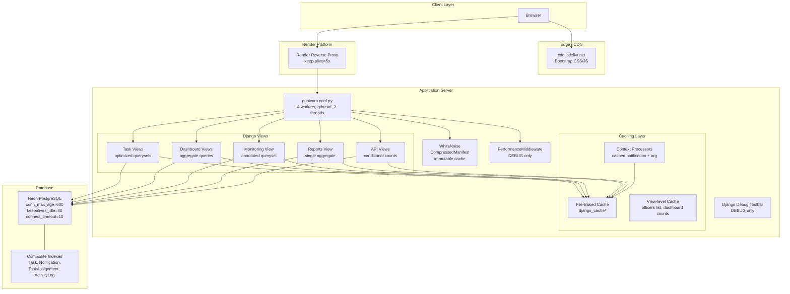

# Design Document: Performance Optimization

## Overview

This design covers a comprehensive performance optimization of the CSG Task Management System across six layers: database queries, caching, static assets, deployment configuration, frontend rendering, and observability. The optimizations target measurable bottlenecks identified in the current codebase — N+1 queries in board/chart views, redundant count() calls in reports, per-object loops in bulk operations, sub-optimal static file serving, and missing database indexes.

The approach follows the principle of smallest safe change: each optimization preserves tenant isolation, role-based access, and response semantics. No public URL patterns, response formats, or permission behaviors change.

**Key Design Decisions:**
1. Keep file-based cache (no Redis) — Render free-tier constraint, already in place
2. Use `gunicorn.conf.py` over render.yaml inline args — easier to version and test
3. Add performance middleware only in DEBUG mode — zero overhead in production
4. Prefer Django ORM aggregation over raw SQL — maintains portability and readability
5. Use `bulk_update`/`bulk_create` with explicit field lists — safe, auditable bulk ops

## Architecture



## Components and Interfaces

### 1. Query Optimizer Components

#### TaskBoardView Optimization
**Current:** Issues N queries (one per status column for tasks + one per status for count).  
**Optimized:** Single base queryset with `select_related`/`prefetch_related`, then Python-level grouping by status. Single aggregate `Count` query grouped by status.

```python
# core/query_utils.py
from django.db.models import Count, Q
from collections import defaultdict

def group_tasks_by_status(queryset, status_choices, limit_per_group=50):
    """
    Given a queryset of tasks with select_related/prefetch_related already applied,
    fetch all tasks and group them by status in Python.
    Returns dict[status_code] -> list[Task] (capped at limit_per_group).
    Also returns counts dict[status_code] -> int (full count per status).
    """
    # Single aggregate query for counts
    counts_qs = queryset.values('status').annotate(count=Count('id'))
    counts = {item['status']: item['count'] for item in counts_qs}
    
    # Fetch tasks grouped in-memory (limited per group)
    # Use a single queryset fetch with ordering, then slice in Python
    all_tasks = list(queryset.order_by('status', '-created_at'))
    grouped = defaultdict(list)
    for task in all_tasks:
        if len(grouped[task.status]) < limit_per_group:
            grouped[task.status].append(task)
    
    return grouped, counts
```

#### DashboardChartsAPIView Optimization
**Current:** Individual queries per status, per priority, per month (loop), per day (loop).  
**Optimized:** Conditional `Count` aggregates and `TruncMonth`/`TruncDate` grouping.

```python
# Optimized status + priority distribution (single query)
from django.db.models import Count, Q, Case, When, IntegerField
from django.db.models.functions import TruncMonth, TruncDate

def get_distributions(base_qs):
    """Single query for status + priority distributions."""
    agg_kwargs = {}
    for code, label in Task.STATUS_CHOICES:
        agg_kwargs[f'status_{code}'] = Count('id', filter=Q(status=code))
    for code, label in Task.PRIORITY_CHOICES:
        agg_kwargs[f'priority_{code}'] = Count('id', filter=Q(priority=code))
    return base_qs.aggregate(**agg_kwargs)


def get_monthly_completed(base_qs, start_date):
    """Single query for monthly completed tasks using TruncMonth."""
    return (
        base_qs
        .filter(status='completed', completion_date__gte=start_date)
        .annotate(month=TruncMonth('completion_date'))
        .values('month')
        .annotate(count=Count('id'))
        .order_by('month')
    )


def get_weekly_trend(base_qs, start_date, end_date):
    """Single query for daily completed tasks over 7 days."""
    return (
        base_qs
        .filter(status='completed', completion_date__gte=start_date, completion_date__lte=end_date)
        .annotate(day=TruncDate('completion_date'))
        .values('day')
        .annotate(count=Count('id'))
        .order_by('day')
    )
```

#### DashboardStatsAPIView Optimization
**Current:** 4 separate count() calls.  
**Optimized:** Single aggregate with conditional Count.

```python
def get_dashboard_stats(base_qs, today):
    """Single aggregate query for all dashboard counts."""
    active_statuses = ['not_started', 'processing', 'to_advisers', 
                       'accounting', 'oca', 'osas', 'ppss', 'supply']
    return base_qs.aggregate(
        active=Count('id', filter=Q(status__in=active_statuses)),
        completed=Count('id', filter=Q(status='completed')),
        overdue=Count('id', filter=Q(due_date__lt=today) & Q(status__in=active_statuses)),
        upcoming=Count('id', filter=Q(
            due_date__gte=today,
            due_date__lte=today + timezone.timedelta(days=7),
            status__in=active_statuses
        )),
    )
```

#### ReportsDashboardView Optimization
**Current:** Calls `tasks.count()`, `active_tasks.count()`, `completed_tasks.count()` on overlapping querysets.  
**Optimized:** Single aggregate from the filtered queryset.

```python
def get_report_counts(tasks_qs, today):
    """Single aggregate for report summary stats."""
    return tasks_qs.aggregate(
        total=Count('id'),
        completed=Count('id', filter=Q(status='completed')),
        active=Count('id', filter=~Q(status='completed')),
        overdue=Count('id', filter=Q(due_date__lt=today) & ~Q(status='completed')),
        in_progress=Count('id', filter=~Q(status__in=['not_started', 'completed'])),
    )
```

### 2. Performance Middleware

```python
# core/middleware.py
import time
import logging
from django.conf import settings
from django.db import connection

logger = logging.getLogger('csg.performance')

QUERY_COUNT_THRESHOLD = getattr(settings, 'PERF_QUERY_COUNT_THRESHOLD', 15)
REQUEST_DURATION_THRESHOLD_MS = getattr(settings, 'PERF_REQUEST_DURATION_THRESHOLD_MS', 2000)


class PerformanceMonitoringMiddleware:
    """
    Middleware that tracks query count and request duration.
    In DEBUG mode: adds X-Query-Count and X-Query-Time-Ms headers.
    Always: logs warnings when thresholds are exceeded.
    """
    def __init__(self, get_response):
        self.get_response = get_response

    def __call__(self, request):
        start_time = time.time()
        initial_queries = len(connection.queries)

        response = self.get_response(request)

        duration_ms = int((time.time() - start_time) * 1000)
        query_count = len(connection.queries) - initial_queries
        query_time_ms = int(sum(
            float(q.get('time', 0)) for q in connection.queries[initial_queries:]
        ) * 1000)

        # Log warnings for threshold violations
        if query_count > QUERY_COUNT_THRESHOLD:
            logger.warning(
                f"High query count: {request.path} executed {query_count} queries"
            )
        if duration_ms > REQUEST_DURATION_THRESHOLD_MS:
            logger.warning(
                f"Slow request: {request.path} took {duration_ms}ms"
            )

        # Add debug headers only in DEBUG mode
        if settings.DEBUG:
            response['X-Query-Count'] = str(query_count)
            response['X-Query-Time-Ms'] = str(query_time_ms)

        return response
```

### 3. Cache Invalidation Service

```python
# core/cache_utils.py
from django.core.cache import cache


def invalidate_task_caches(organization_id):
    """Invalidate all task-related caches for an organization."""
    cache.delete(f'officers_list_{organization_id}')
    # Dashboard count caches use pattern: dashboard_counts_{user_id}_{scope}
    # We cannot iterate all user keys with file cache, so we use a version key
    cache.delete(f'dashboard_version_{organization_id}')


def get_dashboard_cache_key(user_id, scope, org_id):
    """Generate versioned dashboard cache key."""
    version = cache.get(f'dashboard_version_{org_id}', 0)
    return f'dashboard_counts_{user_id}_{scope}_v{version}'


def invalidate_officers_cache(organization_id):
    """Invalidate officers list cache for an organization."""
    cache.delete(f'officers_list_{organization_id}')
    cache.delete('officers_list_all')


def invalidate_org_cache():
    """Invalidate approved organizations cache."""
    cache.delete('approved_orgs_list')
```

### 4. Bulk Operations Service

```python
# tasks/services.py (additions)
from django.db import transaction
from django.utils import timezone
from tasks.models import Task, TaskHistory, TaskAssignment
from notifications.models import Notification


def bulk_complete_tasks(queryset, user):
    """
    Mark multiple tasks as completed using bulk operations.
    Returns the count of updated tasks.
    
    Uses at most 3 write queries:
    - 1 bulk_update for task fields
    - 1 bulk_create for TaskHistory records
    - 1 bulk_create for Notification records
    """
    now_date = timezone.now().date()
    status_dict = dict(Task.STATUS_CHOICES)
    
    tasks_to_update = []
    history_records = []
    notification_records = []
    
    # Prefetch assignments for notification creation
    tasks = list(queryset.exclude(status='completed').prefetch_related('assignments__officer'))
    
    for task in tasks:
        old_status = task.status
        task.status = 'completed'
        task.completion_date = now_date
        task.progress = 100
        tasks_to_update.append(task)
        
        history_records.append(TaskHistory(
            task=task,
            changed_by=user,
            field_changed='Status',
            old_value=status_dict.get(old_status, old_status),
            new_value='Completed'
        ))
        
        for assignment in task.assignments.all():
            notification_records.append(Notification(
                recipient=assignment.officer,
                title='Task Completed',
                message=f'Task "{task.title}" has been marked as completed.',
                notification_type='task_completed',
                related_task=task
            ))
    
    with transaction.atomic():
        if tasks_to_update:
            Task.objects.bulk_update(
                tasks_to_update,
                fields=['status', 'completion_date', 'progress']
            )
        if history_records:
            TaskHistory.objects.bulk_create(history_records)
        if notification_records:
            Notification.objects.bulk_create(notification_records)
    
    return len(tasks_to_update)


def bulk_reassign_officers(task, new_officers, assigned_by):
    """
    Reassign officers to a task using bulk operations.
    Single delete + bulk_create within a transaction.
    """
    with transaction.atomic():
        TaskAssignment.objects.filter(task=task).delete()
        assignments = [
            TaskAssignment(task=task, officer=officer, assigned_by=assigned_by)
            for officer in new_officers
        ]
        if assignments:
            TaskAssignment.objects.bulk_create(assignments)
```

### 5. Gunicorn Configuration

```python
# gunicorn.conf.py (project root)
import multiprocessing
import os

# Worker configuration
worker_class = 'gthread'
workers = int(os.environ.get('WEB_CONCURRENCY', 4))
threads = 2
timeout = 120
keepalive = 5

# Worker recycling to prevent memory leaks
max_requests = 1000
max_requests_jitter = 50

# Logging
accesslog = '-'
errorlog = '-'
loglevel = 'info'

# Bind
bind = f"0.0.0.0:{os.environ.get('PORT', '8000')}"
```

### 6. WhiteNoise / Static Asset Configuration

```python
# Settings additions (csg_project/settings.py)

# WhiteNoise configuration
WHITENOISE_MAX_AGE = 31536000  # 365 days for hashed files
WHITENOISE_ALLOW_ALL_ORIGINS = True  # CORS for static assets

# Storage backend selection
if not DEBUG:
    STORAGES = {
        "default": {
            "BACKEND": "core.storage.SmartMediaCloudinaryStorage",
        },
        "staticfiles": {
            "BACKEND": "whitenoise.storage.CompressedManifestStaticFilesStorage",
        },
    }
else:
    STORAGES = {
        "default": {
            "BACKEND": "core.storage.SmartMediaCloudinaryStorage",
        },
        "staticfiles": {
            "BACKEND": "django.contrib.staticfiles.storage.StaticFilesStorage",
        },
    }
```

### 7. Database Connection Configuration

```python
# Enhanced database configuration
DATABASES = {
    'default': dj_database_url.parse(
        NEON_DB_URL,
        ssl_require=not ('localhost' in NEON_DB_URL or '127.0.0.1' in NEON_DB_URL),
        conn_max_age=600,
        conn_health_checks=True,
    )
}
DATABASES['default'].setdefault('OPTIONS', {})
DATABASES['default']['OPTIONS'].update({
    'connect_timeout': 10,
    'keepalives_idle': 30,
})
```

### 8. Database Index Additions

New indexes to be added via migrations:

| Model | Index Fields | Purpose |
|-------|-------------|---------|
| Task | `(organization_id, is_archived, status)` | Already exists ✓ |
| Task | `(organization_id, due_date)` | Already exists ✓ |
| TaskAssignment | `(officer_id, task_id)` | Already exists ✓ |
| Notification | `(recipient_id, is_read, -created_at)` | Already exists ✓ |
| ActivityLog | `(organization_id, -timestamp)` | Already exists ✓ |

**Note:** After reviewing the current model Meta definitions, all required indexes already exist. No new migrations are needed for index additions. The existing indexes cover:
- Task: `(organization, status, is_archived)`, `(organization, due_date)`, `(status, due_date)`, `(-created_at)`
- TaskAssignment: `(officer, task)`, `(task,)`
- Notification: `(recipient, is_read, -created_at)`, `(recipient, -created_at)`
- ActivityLog: `(-timestamp)`, `(organization, -timestamp)`, `(action, -timestamp)`

## Data Models

No new models are introduced. The optimization modifies how existing models are queried and cached.

### Cache Key Schema

| Cache Key Pattern | TTL | Scope | Invalidation Trigger |
|---|---|---|---|
| `notif_unread_{user_id}` | 30s | Per-user | Notification create/update/delete |
| `officers_list_{org_pk}` | 60s | Per-org | Officer create/update/delete |
| `officers_list_all` | 60s | Global (super admin) | Officer create/update/delete |
| `approved_orgs_list` | 60s | Global (super admin) | Organization status change |
| `dashboard_counts_{user_id}_{scope}_v{version}` | 30s | Per-user, per-scope | Task create/update/delete (via version bump) |
| `dashboard_version_{org_id}` | None | Per-org | Task create/update/delete |

### Configuration Constants

```python
# settings.py additions
PERF_QUERY_COUNT_THRESHOLD = 15    # Warn if request exceeds this query count
PERF_REQUEST_DURATION_THRESHOLD_MS = 2000  # Warn if request exceeds this duration
```

## Correctness Properties

*A property is a characteristic or behavior that should hold true across all valid executions of a system — essentially, a formal statement about what the system should do. Properties serve as the bridge between human-readable specifications and machine-verifiable correctness guarantees.*

### Property 1: Query Optimization Equivalence

*For any* set of tasks in a tenant's dataset and any combination of filter parameters (status, priority, date range, officer assignment), the optimized aggregate query functions (get_distributions, get_monthly_completed, get_weekly_trend, get_dashboard_stats, get_report_counts) SHALL produce output identical to computing the same values via individual filtered count() calls on the same base queryset.

**Validates: Requirements 2.8**

### Property 2: Cache-Database Equivalence

*For any* authenticated request where cached data is served, the cached response content SHALL be semantically equivalent to the response that would be generated by querying the database directly with the same user, organization, and request parameters.

**Validates: Requirements 13.5**

### Property 3: Cache Tenant Isolation

*For any* two users belonging to different organizations, the set of cache keys accessible to user A and the set of cache keys accessible to user B SHALL have zero intersection for organization-scoped data (officers list, dashboard counts, task data). Every organization-scoped cache key SHALL contain the organization identifier as a component.

**Validates: Requirements 7.6, 13.4**

### Property 4: View-Level Tenant Isolation Preservation

*For any* user and organization pair, the set of task records returned by any optimized view (Task_List_View, Task_Board_View, Report_View, Monitoring_View, DashboardChartsAPIView, DashboardStatsAPIView) SHALL be identical to the set returned by the original un-optimized view for the same user and organization context.

**Validates: Requirements 13.2**

### Property 5: Fragment Extraction Correctness

*For any* HTML string containing FRAGMENT_START and FRAGMENT_END markers, the FragmentResponseMixin SHALL return exactly the content between FRAGMENT_START and FRAGMENT_END (plus any content between FRAGMENT_SCRIPTS_START and FRAGMENT_SCRIPTS_END), and SHALL NOT include any content outside those markers (sidebar, topbar, modal HTML).

**Validates: Requirements 10.1**

### Property 6: Pagination Filter Preservation

*For any* combination of active filter and sort parameters (q, status, priority, category, officer, sort, scope) applied to a paginated view, the pagination links for all pages SHALL preserve every filter parameter exactly as submitted in the original request, such that navigating to page N and back to page 1 yields the same filtered result set.

**Validates: Requirements 11.7**

### Property 7: Bulk Operation Bounded Queries

*For any* number of tasks N (where 1 ≤ N ≤ 50), performing a bulk complete operation SHALL execute at most 3 database write queries (one bulk_update for tasks, one bulk_create for history, one bulk_create for notifications), regardless of N.

**Validates: Requirements 14.7**

### Property 8: Cache Invalidation on Mutation

*For any* task create, update, or delete operation within an organization, the cache keys for that organization's officers list and dashboard counts SHALL be invalidated within the same request-response cycle, such that the immediately subsequent request returns fresh data reflecting the mutation.

**Validates: Requirements 7.4, 13.6**


## Error Handling

### Cache Failures

| Scenario | Handling | User Impact |
|----------|----------|-------------|
| Cache read returns None (miss) | Query database, populate cache | None — transparent |
| Cache backend unavailable (FileNotFoundError, IOError) | Catch exception, query database directly | None — slight latency increase |
| Cache write fails | Log warning, continue without caching | None — next request will also miss |
| Corrupt cache data (unpickling error) | Catch exception, delete key, query database | None — self-healing |

```python
# Pattern for graceful cache fallback
from django.core.cache import cache
import logging

logger = logging.getLogger('csg.performance')

def safe_cache_get(key, fallback_fn, timeout=60):
    """
    Attempt cache read; on any failure, execute fallback_fn and cache result.
    Never raises to caller — always returns valid data.
    """
    try:
        value = cache.get(key)
        if value is not None:
            return value
    except Exception as e:
        logger.warning(f"Cache read failed for key={key}: {e}")
    
    value = fallback_fn()
    
    try:
        cache.set(key, value, timeout)
    except Exception as e:
        logger.warning(f"Cache write failed for key={key}: {e}")
    
    return value
```

### Database Connection Failures

| Scenario | Handling | User Impact |
|----------|----------|-------------|
| connect_timeout exceeded (10s) | Retry once with same timeout | Brief delay (up to 20s total) |
| Retry also fails | Return HTTP 503 with friendly error page | User sees "temporarily unavailable" |
| Connection dropped mid-request | Django auto-reconnects on next query (CONN_HEALTH_CHECKS) | None for subsequent queries |
| Neon idle disconnect | keepalives_idle=30s prevents premature drops; health check validates before reuse | None |

```python
# Database retry middleware (simplified)
from django.db import OperationalError
from django.http import HttpResponse

class DatabaseRetryMiddleware:
    """Retry database connection failures once before returning 503."""
    
    def __init__(self, get_response):
        self.get_response = get_response

    def __call__(self, request):
        try:
            return self.get_response(request)
        except OperationalError as e:
            if 'connect_timeout' in str(e) or 'connection' in str(e).lower():
                try:
                    from django.db import connection
                    connection.close()
                    return self.get_response(request)
                except OperationalError:
                    return HttpResponse(
                        'Database temporarily unavailable. Please try again.',
                        status=503,
                        content_type='text/plain'
                    )
            raise
```

### Bulk Operation Failures

| Scenario | Handling | User Impact |
|----------|----------|-------------|
| bulk_update/bulk_create raises IntegrityError | transaction.atomic() rolls back all changes | Error message: "Operation did not complete" |
| Partial failure mid-batch | Same — full rollback within atomic block | No partial state visible |
| Task count exceeds 50 limit | Reject request before processing, return error message | Warning: "Maximum 50 tasks per bulk operation" |

### Performance Threshold Violations

| Scenario | Handling | User Impact |
|----------|----------|-------------|
| Query count > 15 (configurable) | Log WARNING to csg.performance logger | None (developer visibility only) |
| Request duration > 2000ms (configurable) | Log WARNING to csg.performance logger | None (developer visibility only) |
| Individual query > 100ms (DEBUG only) | Log WARNING via Django database logger | None (developer visibility only) |

## Testing Strategy

### Dual Testing Approach

This feature uses both unit/integration tests and property-based tests for comprehensive coverage.

**Property-Based Testing Library:** [Hypothesis](https://hypothesis.readthedocs.io/) (Python's standard PBT library for Django projects)

**Configuration:** Each property test runs a minimum of 100 iterations via Hypothesis settings.

### Property-Based Tests

Each correctness property maps to a single Hypothesis test:

| Property | Test Description | Key Generators |
|----------|-----------------|----------------|
| 1: Query Optimization Equivalence | Compare aggregate results vs naive loop results | Random task sets with varying statuses/priorities/dates |
| 2: Cache-Database Equivalence | Compare cached response vs fresh DB response | Random user/org/filter combinations |
| 3: Cache Tenant Isolation | Verify cache keys never collide across orgs | Random org ID pairs |
| 4: View-Level Tenant Isolation | Verify optimized views return same data as original | Random multi-tenant task datasets |
| 5: Fragment Extraction | Verify only marker-bounded content returned | Random HTML with markers at various positions |
| 6: Pagination Filter Preservation | Verify all params preserved in pagination URLs | Random filter parameter dicts |
| 7: Bulk Bounded Queries | Verify ≤3 writes for any task count 1-50 | Random integers 1-50 |
| 8: Cache Invalidation | Verify mutation invalidates correct cache keys | Random task CRUD sequences |

**Tag Format:** Each test is tagged with:
```python
# Feature: performance-optimization, Property {N}: {property_text}
```

### Integration Tests

| Area | Test Cases | Assertion Method |
|------|-----------|-----------------|
| Task List View queries | Warm cache, cold cache, with filters | `assertNumQueries(<=4)` |
| Board View queries | Multiple columns, varying task counts | `assertNumQueries` for single base query |
| Dashboard aggregate | Single vs multiple orgs | `assertNumQueries(1)` for counts |
| Charts API | Status, priority, monthly, weekly | `assertNumQueries` per section |
| Bulk complete | 1, 10, 50 tasks | `assertNumQueries(<=3)` for writes |
| Context processors | Cached vs uncached, authenticated vs anonymous | `assertNumQueries` |
| Fragment responses | With markers, without markers, scripts present | Response content inspection |
| Pagination | Page bounds, filter preservation, last page fallback | Status codes, URL params |

### Unit Tests (Example-Based)

| Component | Test Cases |
|-----------|-----------|
| `safe_cache_get` | Cache hit, cache miss, cache error, corrupt data |
| `invalidate_task_caches` | Correct keys deleted |
| `get_dashboard_cache_key` | Format includes user_id, scope, org_id, version |
| `group_tasks_by_status` | Empty queryset, single status, all statuses, >50 per group |
| `bulk_complete_tasks` | Zero tasks, one task, max tasks, already-completed tasks |
| `bulk_reassign_officers` | Empty list, single officer, multiple officers |
| Gunicorn config | Values match expected (workers=4, timeout=120, etc.) |
| WhiteNoise settings | DEBUG=True vs DEBUG=False storage backends |
| Performance middleware | Headers present in DEBUG, absent in production |

### Smoke Tests

| Check | Expected |
|-------|----------|
| All required indexes exist in migration state | Verified via `sqlmigrate` or Meta inspection |
| `brotli` in requirements.txt | Present with pinned version |
| `gunicorn.conf.py` exists at project root | File exists with correct values |
| WhiteNoise WHITENOISE_MAX_AGE = 31536000 | Setting value check |
| CONN_MAX_AGE = 600, connect_timeout = 10 | Settings check |
| Debug Toolbar not in INSTALLED_APPS when DEBUG=False | Conditional check |

### Test Execution

```bash
# Run all tests
python manage.py test

# Run property tests only (tagged)
python -m pytest tests/properties/ -v --hypothesis-show-statistics

# Run integration tests
python manage.py test --tag=performance

# Run with query logging for debugging
DEBUG=True python manage.py test --verbosity=2
```
