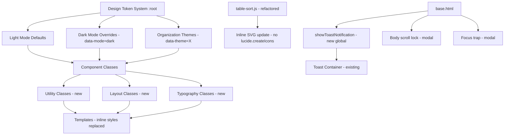
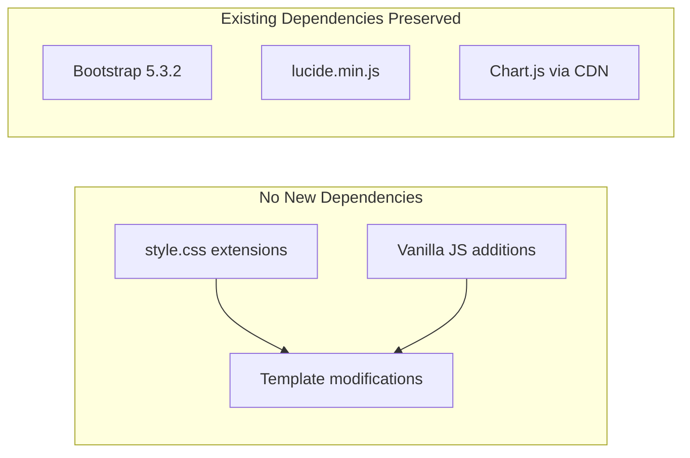

# Design Document: UI/UX Audit Improvement

## Overview

This design addresses a comprehensive UI/UX audit of the CSG Task Management System, targeting 12 areas: dark mode consistency, layout shift prevention, mobile responsiveness, alert() replacement, inline style consolidation, table improvements, form styling, modal behavior, typography standardization, spacing consistency, accessibility, and functionality preservation.

The approach is additive and non-destructive — extending the existing `style.css` design token system, extracting inline styles into reusable classes, and refactoring JavaScript alert patterns into the existing toast infrastructure. No new build tools, frameworks, or dependencies are introduced.

### Design Principles

1. **Token-first styling**: All new rules use existing CSS custom properties (`--space-*`, `--radius-*`, color tokens) rather than hardcoded values
2. **Cascade over specificity**: Dark mode handled via `[data-mode="dark"]` selector layering, avoiding `!important` where possible (with the exception of overriding Bootstrap utilities that already use `!important`)
3. **Progressive enhancement**: Mobile-first media queries ensure base styles work at 320px, enhanced for larger viewports
4. **Zero regressions**: Every change preserves computed output of existing styles; organization themes, sidebar, charts, AJAX, and modal systems remain functionally identical

## Architecture

### High-Level Architecture



### File Modification Map

| File | Change Type | Purpose |
|------|-------------|---------|
| `static/css/style.css` | Extend | Add utility classes, typography scale, spacing utilities, responsive fixes, dark mode gap-fills |
| `templates/base.html` | Modify | Add `showToastNotification()` global, replace `alert()` calls, add ARIA attributes, focus trap logic |
| `templates/tasks/list.html` | Modify | Replace `alert()` calls, add ARIA to sortable headers, replace inline styles with classes |
| `templates/tasks/detail.html` | Modify | Replace `alert()` call, add ARIA attributes |
| `templates/tasks/_modal_detail.html` | Modify | Replace `alert()` call, add ARIA attributes |
| `templates/tasks/board.html` | Modify | Replace inline styles with utility classes |
| `templates/tasks/calendar.html` | Modify | Replace inline styles with utility classes |
| `templates/core/dashboard.html` | Modify | Replace inline styles, add chart container dimensions |
| `static/js/table-sort.js` | Refactor | Inline SVG swap instead of `lucide.createIcons()`, add `aria-sort` |

### Dependency Graph



## Components and Interfaces

### 1. Design Token Extensions (CSS Custom Properties)

New tokens added to `:root` to fill gaps identified in the audit:

```css
:root {
  /* Typography Scale (1.2x ratio - Minor Third) */
  --font-size-xs:      0.6875rem;  /* 11px */
  --font-size-sm:      0.8125rem;  /* 13px */
  --font-size-base:    0.875rem;   /* 14px — body default */
  --font-size-md:      1rem;       /* 16px */
  --font-size-lg:      1.25rem;    /* 20px */
  --font-size-xl:      1.5rem;     /* 24px */
  --font-size-display: 2rem;       /* 32px */

  /* Line Heights */
  --line-height-heading: 1.2;
  --line-height-body:    1.5;
  --line-height-compact: 1.3;

  /* Font Weights */
  --font-weight-heading: 800;
  --font-weight-subheading: 700;
  --font-weight-label: 600;

  /* Letter Spacing */
  --letter-spacing-title: -0.3px;
  --letter-spacing-uppercase: 0.8px;

  /* Form token */
  --input-font-size: 0.875rem;  /* 14px */
  --input-border-radius: var(--radius-sm); /* 10px */
}
```

### 2. Typography Utility Classes

```css
.text-xs      { font-size: var(--font-size-xs) !important; }
.text-sm      { font-size: var(--font-size-sm) !important; }
.text-base    { font-size: var(--font-size-base) !important; }
.text-md      { font-size: var(--font-size-md) !important; }
.text-lg      { font-size: var(--font-size-lg) !important; }
.text-xl      { font-size: var(--font-size-xl) !important; }
.text-display { font-size: var(--font-size-display) !important; }

.heading-page    { font-size: var(--font-size-xl); font-weight: var(--font-weight-heading); letter-spacing: var(--letter-spacing-title); line-height: var(--line-height-heading); }
.heading-card    { font-size: var(--font-size-md); font-weight: var(--font-weight-subheading); letter-spacing: var(--letter-spacing-title); line-height: var(--line-height-heading); }
.heading-section { font-size: var(--font-size-sm); font-weight: var(--font-weight-label); line-height: var(--line-height-compact); }
.label-uppercase { font-size: var(--font-size-xs); font-weight: var(--font-weight-subheading); letter-spacing: var(--letter-spacing-uppercase); text-transform: uppercase; }
```

### 3. Spacing Utility Classes

```css
/* Padding utilities using 8-point scale */
.p-token-1  { padding: var(--space-1) !important; }
.p-token-2  { padding: var(--space-2) !important; }
.p-token-3  { padding: var(--space-3) !important; }
.p-token-4  { padding: var(--space-4) !important; }
.p-token-5  { padding: var(--space-5) !important; }
/* ... px, py, pt, pb, pl, pr variants for each */

/* Margin utilities */
.m-token-1  { margin: var(--space-1) !important; }
/* ... full set */

/* Gap utilities for flex/grid */
.gap-token-1 { gap: var(--space-1) !important; }
.gap-token-2 { gap: var(--space-2) !important; }
.gap-token-3 { gap: var(--space-3) !important; }
.gap-token-4 { gap: var(--space-4) !important; }
.gap-token-5 { gap: var(--space-5) !important; }
```

### 4. Extracted Component Classes (Inline Style Consolidation)

```css
/* Filter Select — replaces repeated inline styles on task list/board/calendar */
.filter-select {
  font-size: var(--font-size-sm);
  border-radius: var(--radius-sm);
  width: auto;
  min-width: 120px;
  max-width: 150px;
  padding: 6px 28px 6px 10px;
  border: 1.5px solid var(--slate-200);
  background: rgba(255, 255, 255, 0.9);
  color: var(--slate-800);
  transition: all var(--transition);
}

/* Scope Switcher (dashboard) */
.scope-switcher-btn {
  font-weight: var(--font-weight-subheading);
  font-size: var(--font-size-xs);
  border-radius: var(--radius-pill);
  padding: var(--space-1) 14px;
}

/* View Switcher (task list) */
.view-switcher-btn {
  font-size: var(--font-size-xs);
  padding: var(--space-1) 14px;
  border-radius: var(--radius-pill);
}

/* Badge pill (officer assignment, overflow count) */
.badge-pill-sm {
  font-size: 10.5px;
  font-weight: var(--font-weight-label);
  padding: var(--space-1) var(--space-2);
  border-radius: var(--radius-sm);
}

/* Action button compact (Apply, Reset, New Task) */
.btn-action-compact {
  font-size: var(--font-size-xs);
  padding: 6px var(--space-4);
  border-radius: var(--radius-sm);
  white-space: nowrap;
}
```

### 5. showToastNotification() — Global Toast Function

Added to `base.html` as a globally available function that works on every page:

```javascript
/**
 * Show a styled toast notification replacing all alert() usage.
 * @param {string} message - The message to display
 * @param {string} type - 'error'|'warning'|'success'|'info' (default: 'error')
 * @param {number} duration - Auto-dismiss in ms (default: 5000)
 */
window.showToastNotification = function(message, type, duration) {
  type = type || 'error';
  duration = duration || 5000;
  
  const alertClass = type === 'error' ? 'alert-danger' : 'alert-' + type;
  const iconClass = type === 'error' ? 'bi-exclamation-triangle'
    : type === 'success' ? 'bi-check-circle'
    : type === 'warning' ? 'bi-exclamation-circle'
    : 'bi-info-circle';
  
  // Ensure toast container exists
  let container = document.querySelector('.toast-container');
  if (!container) {
    container = document.createElement('div');
    container.className = 'toast-container';
    container.setAttribute('role', 'alert');
    container.setAttribute('aria-live', 'assertive');
    document.body.appendChild(container);
  }
  
  const alertEl = document.createElement('div');
  alertEl.className = `alert ${alertClass} alert-dismissible fade show`;
  alertEl.setAttribute('role', 'alert');
  alertEl.innerHTML = `<i class="bi ${iconClass} me-2"></i>${message}
    <button type="button" class="btn-close" data-bs-dismiss="alert" aria-label="Close"></button>`;
  
  container.appendChild(alertEl);
  
  // Auto-dismiss
  setTimeout(() => {
    try { bootstrap.Alert.getOrCreateInstance(alertEl).close(); } catch(e) { alertEl.remove(); }
  }, duration);
};
```

### 6. Table Sort Refactor (table-sort.js)

Replace `lucide.createIcons()` with inline SVG manipulation:

```javascript
// Instead of:
// container.innerHTML = '<i data-lucide="chevron-up" ...></i>';
// if (window.lucide) lucide.createIcons();

// Use inline SVGs directly:
const SVG_CHEVRON_UP = '<svg xmlns="http://www.w3.org/2000/svg" width="13" height="13" viewBox="0 0 24 24" fill="none" stroke="currentColor" stroke-width="2" stroke-linecap="round" stroke-linejoin="round" style="color:var(--primary)"><path d="m18 15-6-6-6 6"/></svg>';
const SVG_CHEVRON_DOWN = '<svg xmlns="http://www.w3.org/2000/svg" width="13" height="13" viewBox="0 0 24 24" fill="none" stroke="currentColor" stroke-width="2" stroke-linecap="round" stroke-linejoin="round" style="color:var(--primary)"><path d="m6 9 6 6 6-6"/></svg>';
const SVG_NEUTRAL = '<svg xmlns="http://www.w3.org/2000/svg" width="12" height="12" viewBox="0 0 24 24" fill="none" stroke="currentColor" stroke-width="2" stroke-linecap="round" stroke-linejoin="round" style="opacity:0.4"><path d="m7 15 5 5 5-5"/><path d="m7 9 5-5 5 5"/></svg>';

// + Add aria-sort attribute management:
header.setAttribute('aria-sort', activeSortState === 'asc' ? 'ascending' : activeSortState === 'desc' ? 'descending' : 'none');
```

### 7. Modal Focus Trap & Body Scroll Lock

```javascript
// Body scroll lock when modal opens on mobile
document.addEventListener('show.bs.modal', function(e) {
  if (window.innerWidth < 576) {
    document.body.style.overflow = 'hidden';
  }
});
document.addEventListener('hidden.bs.modal', function(e) {
  // Only restore if no other modals are open
  if (!document.querySelector('.modal.show')) {
    document.body.style.overflow = '';
  }
});

// Focus trap within open modal
document.addEventListener('keydown', function(e) {
  if (e.key !== 'Tab') return;
  const activeModal = document.querySelector('.modal.show');
  if (!activeModal) return;
  
  const focusable = activeModal.querySelectorAll(
    'button:not([disabled]), [href], input:not([disabled]), select:not([disabled]), textarea:not([disabled]), [tabindex]:not([tabindex="-1"])'
  );
  if (focusable.length === 0) return;
  
  const first = focusable[0];
  const last = focusable[focusable.length - 1];
  
  if (e.shiftKey && document.activeElement === first) {
    e.preventDefault();
    last.focus();
  } else if (!e.shiftKey && document.activeElement === last) {
    e.preventDefault();
    first.focus();
  }
});
```

### 8. Layout Shift Prevention

```css
/* Chart container reserved height */
.chart-container {
  min-height: 220px;
  position: relative;
}

/* Modal body loading state */
.modal-body-loading {
  min-height: 200px;
  display: flex;
  align-items: center;
  justify-content: center;
}
```

Sidebar state is already read synchronously in `base.html` before first paint via:
```html
<script>
if (localStorage.getItem('csg_sidebar_minimized') === 'true') {
  document.body.classList.add('sidebar-minimized');
}
</script>
```
This remains unchanged.

### 9. Mobile Responsive Enhancements

```css
/* Filter bar stacking below 576px */
@media (max-width: 575.98px) {
  .filter-bar-controls {
    display: flex;
    flex-direction: column;
    gap: var(--space-2);
    width: 100%;
  }
  .filter-bar-controls > * {
    width: 100% !important;
    max-width: 100% !important;
    min-width: 0 !important;
  }
}

/* Filter bar horizontal scroll between 576-767px */
@media (min-width: 576px) and (max-width: 767.98px) {
  .filter-bar-controls {
    display: flex;
    flex-wrap: nowrap;
    overflow-x: auto;
    gap: var(--space-2);
    -webkit-overflow-scrolling: touch;
    padding-bottom: var(--space-2);
  }
}

/* Mobile modal full-width */
@media (max-width: 575.98px) {
  .modal-dialog {
    margin: 8px;
    max-width: calc(100vw - 16px);
  }
  .modal-content {
    max-height: 90vh;
    display: flex;
    flex-direction: column;
  }
  .modal-body {
    overflow-y: auto;
    max-height: calc(90vh - 120px);
  }
  /* Minimum tap targets */
  .btn, button, a.btn, .form-control, .form-select {
    min-height: 44px;
  }
}

/* Table scroll affordance */
@media (max-width: 767.98px) {
  .table-scroll-wrapper {
    position: relative;
    overflow-x: auto;
  }
  .table-scroll-wrapper::after {
    content: '';
    position: absolute;
    top: 0;
    right: 0;
    bottom: 0;
    width: 24px;
    background: linear-gradient(to left, rgba(0,0,0,0.06), transparent);
    pointer-events: none;
    opacity: 1;
    transition: opacity 0.2s;
  }
  .table-scroll-wrapper.scrolled-end::after {
    opacity: 0;
  }
}
```

### 10. Accessibility Layer

Key additions across templates:

| Element | ARIA Enhancement |
|---------|-----------------|
| Sortable headers | `aria-sort="ascending|descending|none"` |
| Toast container | `role="alert" aria-live="assertive"` |
| Filter selects | `aria-label="Filter by [category]"` |
| Icon-only buttons | `aria-label` describing action |
| Sidebar toggles | `aria-expanded="true|false"` |
| Dark mode toggle | `aria-label="Toggle dark mode"` |
| Modals | Focus trap + focus return to trigger |

### 11. Dark Mode Gap-Fills

Additional selectors to cover elements missed in current implementation:

```css
/* Ensure AJAX-loaded fragments inherit dark mode */
[data-mode="dark"] .page-content * {
  /* Inherits from dark mode context automatically via CSS custom properties */
}

/* Chart.js integration */
[data-mode="dark"] .chart-container canvas {
  /* Chart.js config handles this via JS — see chart config section */
}
```

Chart.js dark mode configuration (applied in dashboard chart initialization):
```javascript
function getChartColors() {
  const isDark = document.documentElement.getAttribute('data-mode') === 'dark';
  return {
    gridColor: isDark ? 'rgba(148, 163, 184, 0.12)' : 'rgba(0, 0, 0, 0.06)',
    labelColor: isDark ? '#CBD5E1' : '#64748B',
    tooltipBg: isDark ? '#1E293B' : '#FFFFFF',
    tooltipText: isDark ? '#F8FAFC' : '#1E293B',
    surface: isDark ? 'rgba(30, 41, 59, 0.88)' : 'rgba(255, 255, 255, 0.85)'
  };
}
```

## Data Models

This feature is purely frontend — no database model changes are required. The relevant data structures are:

### CSS Token Schema (Logical)

```
DesignTokenSystem {
  spacing: { space-1..space-8: px values on 8pt scale }
  radius: { xs, sm, md, lg, pill: px values }
  colors: { primary, primary-light, primary-dark, slate-50..900, pink-50..700, semantic colors }
  typography: { font-size-xs..display: rem values, line-heights, weights, letter-spacing }
  shadows: { xs, sm, md, lg, glow: box-shadow values }
  transitions: { fast, default, slow: timing functions }
}
```

### Toast Notification Interface

```typescript
interface ToastOptions {
  message: string;         // Display text
  type: 'error' | 'warning' | 'success' | 'info';  // Maps to Bootstrap alert class
  duration: number;        // Auto-dismiss ms, default 5000, max 5000
}
```

### Table Sort State

```typescript
interface SortState {
  column: HTMLElement | null;  // Active header element
  direction: 'none' | 'asc' | 'desc';  // Cycles on click
}
```

### Modal Focus State

```typescript
interface ModalFocusState {
  triggerElement: HTMLElement;  // Element that opened the modal
  trapped: boolean;            // Whether focus is currently trapped
}
```

